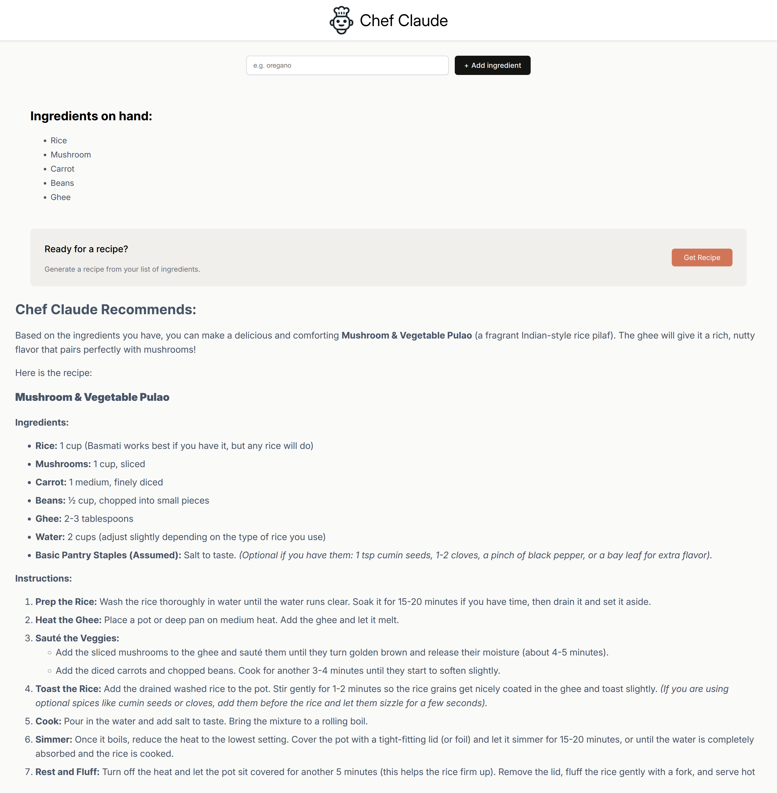

# Chef Claude 👨‍🍳

An AI-powered recipe generator built with **React** as part of the **Learn React** course by **Scrimba**.

Chef Claude lets users build a list of ingredients they have on hand and generates recipe suggestions using AI. The project demonstrates modern React concepts such as state management, forms, conditional rendering, component composition, and API integration.

## 🚀 Demo

https://chef-claude-highblue.vercel.app

---

## 📸 Screenshot



---

## ✨ Features

- Add ingredients through an interactive form
- Maintain a dynamic ingredients list
- Generate AI-powered recipes based on available ingredients
- Conditional rendering for recipe suggestions
- Markdown-formatted recipe display
- Responsive user interface
- Accessible and reusable React components

---

## 🛠️ Built With

- React
- Vite
- JavaScript (ES6+)
- HTML5
- CSS3
- AI API integration (HuggingFace)

---

## 📚 What I Learned

This project helped me strengthen my understanding of:

- Functional React components
- JSX
- Props
- State management using `useState`
- Forms and event handling
- Updating arrays in React state
- Conditional rendering
- Passing data between parent and child components
- Component composition
- Working with asynchronous API requests
- Rendering Markdown content
- Building reusable React applications

---

## 📦 Installation

Clone the repository

```bash
git clone https://github.com/vigneshblue/scrimba-react-chef-claude.git
```

Navigate to the project

```bash
cd scrimba-react-chef-claude
```

Install dependencies

```bash
npm install
```

Start the development server

```bash
npm run dev
```

Open your browser at

```
http://localhost:5173
```

---

## 📂 Project Structure

```
src/
├── components/
├── assets/
├── App.jsx
├── ClaudeRecipe.jsx
├── IngredientsList.jsx
├── Header.jsx
├── main.jsx
└── ...
```

---

## 🎓 Course

This project was created while following the **Learn React** course by **Scrimba**, taught by **Bob Ziroll**.

Course:

https://scrimba.com/learn-react-c0e

Chef Claude is the primary project in the **React State** section of the course. It focuses on building interactive applications using **React state, forms, conditional rendering, component communication, and AI integration**, helping learners understand how to manage complex application state in real-world scenarios. :contentReference[oaicite:0]{index=0}

---

## 🙏 Acknowledgements

Special thanks to **Bob Ziroll** and **Scrimba** for creating an outstanding interactive React course that emphasizes learning through hands-on projects and real-world applications. :contentReference[oaicite:1]{index=1}

---

## 📄 License

This project is intended for learning purposes.